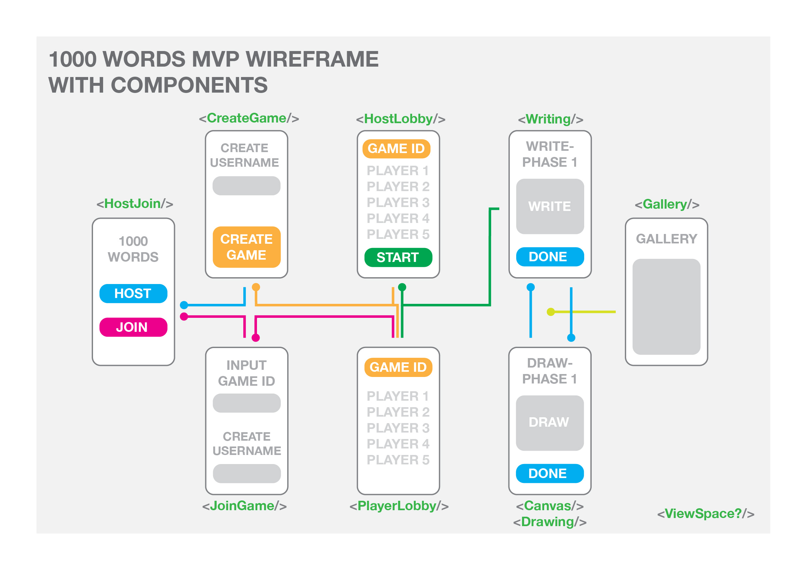
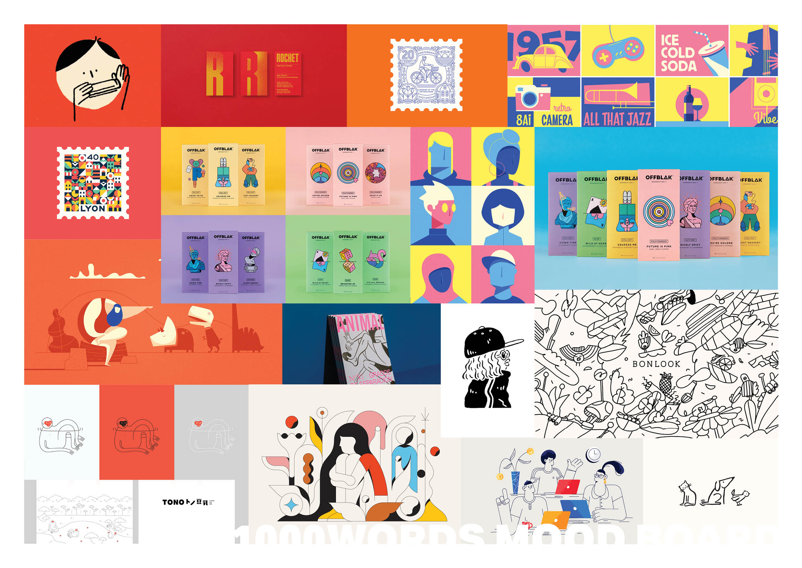

<<<<<<< HEAD
# 1000 Words
||||||| 21ff045
#MVP 
i want a space to draw witch then sends my drawing to someone else
i want the same as above for writing
i 
=======
# MVP 
>>>>>>> ec45b22de0af5d2fa2559912209fee51d22de78d

<<<<<<< HEAD
## Links 
[Trello](https://trello.com/b/j9MCTibC/1000-words)
||||||| 21ff045
# A starter webpack project for React
=======
## Game
- Entry frame: One button to create game ("Host"); one button to join hosted game ("Join")
>>>>>>> ec45b22de0af5d2fa2559912209fee51d22de78d

<<<<<<< HEAD
[Stress Profile and Agreements doc](https://docs.google.com/document/d/1XDfl4KSXsNv2O1jlwnT4XwYGkYKWZhc1MwOkUoYMPxo/edit)
||||||| 21ff045
This is a starter project that uses webpack to transpile and bundle ES6 React code. To use, consider these steps:
=======
- Host button: redirects to a new view with a form to identify number of players; generates game ID; view has "Start" button
>>>>>>> ec45b22de0af5d2fa2559912209fee51d22de78d

<<<<<<< HEAD
# MVP 
||||||| 21ff045
* Fork this repo
* Rename your repo according to the app you're building
=======
- Minimum number of players: 4; Maximum number of players: 10
>>>>>>> ec45b22de0af5d2fa2559912209fee51d22de78d

<<<<<<< HEAD
## Game

- Number of players: minimum - 4; maximum - 10

- Entry frame: One button to create game ("Host"); one button to join hosted game ("Join")

- Host button: redirects to a new view with a form to identify number of players; generates game ID; view has "Start" button

- Join button: redirects to a new view with a form to input the game ID. Submitting the game ID redirects to a form asking for a user name before redirecting to a 'Player screen' ('lobby'), which will be displayed to all until the host starts the game.

- Start button: redirects to the view 'Write something' (form) 

- 'Write Something" View has a 'Done' button. As soon as every player has hit the 'Done'button on their screen, the next view is rendered (each player view calls the db, filling up player-slots, db listens to all slots filling up (see Rubin for details)). The next view will either be the Draw view, or the Gallery view.

- Write Something - Done: Triggers a view with the previous player's written prompt; 'Done' button (for draw screen).

- Draw on prompt - similar behaviour to 'Write Something' view.

Alternate between the two views every time the db slots fill up on 'Done', until player.length has been reached.

If no more rounds to play, render view with gallery of all drawings belonging to the player's own prompt.

# WireFrame and components
Wireframe: 


# MoodBoard
MoodBoard: 



# STRETCH
- Splash page 

- Multiple colours

- Timer


# Data base
### game
|game_id|host|
|--|--|
|1|rubin|
### players
|player_id|player_name|game_id|color|
|--|--|--|--|
|1|rubin|1|green|
### rounds
|player|write_1|draw_1|write_2|draw_2|write_3|draw_3|write_4|draw_4|write_5|draw_5|
|--|--|--|--|--|--|--|--|--|--|--|
|1|a naked sheep|draw_data|what it is|draw data|what it is|draw data|what it is|draw data|what it is|draw data|

# API 
| Method | Endpoint | Usage | Response |
| --- | --- | --- | --- |
|post|api/game/|creates a new game|returns game id|
|get|api/game:id/|checks if game exists|returns true / false|
|get|api/players:id/|get players of game|returns players in game group|
|post|api/players/|add player to player table|returns players in game group|
|get|api/rounds:id/|get all rounds for that game| returns all round for game|
|get|api/rounds/:roundId:playerround|get spesific round & player draw/write|returns spesific round & player draw/write|
|post|api/rounds:id/|updates spesific found for game| returns round|

# pages and api calls
|host join|create game|join game|palyer lobby|writing|drawing/canvas|gallary|
|--|--|--|--|--|--|--|
|none|POST api/game|GET api/game/:id|Web sockets|--|--|--|
|--|--|GET api/players/:id|--|--|--|--|
|--|--|POST api/players/:id|--|--|--|--|

## request and response formats
**POST `api/game/`** 
create game
:request
```json
  {
    "host": "rubin",
  }
```
:response
```json
  {
    "id": 1,
  }
```
**get `api/game/:id`**
join game
:response
```json
  {
    "game": true,
  }
```
**get `api/players/:id`**
join game
:response
```json
[
  {
    "player_id": 1,
    "player_name": "rubin",
    "game_id": 1,
    "color": "black",
  },
  {
    "player_id": 2,
    "player_name": "jayden",
    "game_id": 1,
    "color": "black",
  },
]
```
**POST `api/players/`**
join game
:request
```json
   {
    "player_name": "rubin",
    "game_id": 1,
    "color": "black",
  }
||||||| 21ff045
```sh
git clone https://github.com/[your-account]/[your-app].git
cd [your-app] && npm i
=======
- Join button: redirects to a new view with a form to input the game ID. Submitting the game ID redirects to a form asking for a user name before redirecting to a 'Player screen' ('lobby'), which will be displayed to all until the host starts the game.

- Start button: redirects to view 'Write something' (form); View has 'Done' button. As soon as every player has hit the 'Done'button, the next view is rendered (each player view calls the db, filling up player-slots, db listens to all slots filling up (see Rubin for details)).

- Write Something - Done: Triggers a view with the previous player's written prompt; 'Done' button (for draw screen). 

Alternate between the two views every time the db slots fill up on 'Done', until player.length has been reached.

If no more rounds to play, render view with gallery of all drawings belonging to the player's own prompt.

# STRETCH
Splash page 
Multiple colours
Timer

# Data base
### game
|game_id|host|
|--|--|
|1|rubin|
### players
|player_id|player_name|game_id|color|
|--|--|--|--|
|1|rubin|1|green|
### rounds
|player|write_1|draw_1|write_2|draw_2|write_3|draw_3|write_4|draw_4|write_5|draw_5|
|--|--|--|--|--|--|--|--|--|--|--|
|1|a naked sheep|draw_data|what it is|draw data|what it is|draw data|what it is|draw data|what it is|draw data|

# API 
| Method | Endpoint | Usage | Response |
| --- | --- | --- | --- |
|post|api/game/|creates a new game|returns game id|
|get|api/game:id/|checks if game exists|returns true / false|
|get|api/players:id/|get players of game|returns players in game group|
|post|api/players/|add player to player table|returns players in game group|
|get|api/rounds:id/|get all rounds for that game| returns all round for game|
|get|api/rounds/:gameId:roundnum|get spesific round & player draw/write|returns spesific round & player draw/write|
|post|api/rounds:id/|updates spesific found for game| returns round|

## request and response formats
**POST `api/game/`**

:request
```json
  {
    "host": "rubin",
  }
>>>>>>> ec45b22de0af5d2fa2559912209fee51d22de78d
```
<<<<<<< HEAD
:response
```json
[
  {
    "player_id": 1,
    "player_name": "rubin",
    "game_id": 1,
    "color": "black",
  },
  {
    "player_id": 2,
    "player_name": "jayden",
    "game_id": 1,
    "color": "black",
  },
]
```
**get `api/rounds/:id`**

:response
```json
[
  {
    "player": 1,
    "write_1": "text",
    "draw_1": [data],
    "write_2": "text",
    "draw_2": [data],
    "write_3": "text",
    "draw_3": [data],
    "write_4": "text",
    "draw_4": [data],
    "write_5": "text",
    "draw_5": [data],
  },
  {
    "player": 2,
    "write_1": "text",
    "draw_1": [data],
    "write_2": "text",
    "draw_2": [data],
    "write_3": "text",
    "draw_3": [data],
    "write_4": "text",
    "draw_4": [data],
    "write_5": "text",
    "draw_5": [data],
  },
]
```
**get `api/rounds/:roundid:playerround`**
||||||| 21ff045
=======
:response
```json
  {
    "id": 1,
  }
```
**get `api/game/:id`**
>>>>>>> ec45b22de0af5d2fa2559912209fee51d22de78d

<<<<<<< HEAD
:response
```json
  {
    "player": 2,
    "round": 2,
    "data": [data] or "text", //depending on round
  }
||||||| 21ff045
To start the development server with a watcher that rebuilds your code, run `npm run dev`. The assets built by webpack are placed in `server/public`. This folder is defined as a static folder in an Express.js server that can be started with `npm run server`.
=======
:response
```json
  {
    "game": true,
  }
```
**get `api/players/:id`**
>>>>>>> ec45b22de0af5d2fa2559912209fee51d22de78d

<<<<<<< HEAD
||||||| 21ff045
Additional components should be placed in `client/components`.
=======
:response
```json
[
  {
    "player_id": 1,
    "player_name": "rubin",
    "game_id": 1,
    "color": "black",
  },
  {
    "player_id": 2,
    "player_name": "jayden",
    "game_id": 1,
    "color": "black",
  },
]
```
**POST `api/players/`**
>>>>>>> ec45b22de0af5d2fa2559912209fee51d22de78d

<<<<<<< HEAD
```

**POST `api/round/:id`**

:request
```json
  {
    "player": 2,
    "round": 4,
    "data": [data] or "text", //depending on round
  }
```
:response
```json
    {
    "player": 2,
    "write_1": "text",
    "draw_1": [data],
    "write_2": "text",
    "draw_2": [data],   //<-- where data should be
    "write_3": "text",
    "draw_3": [data],
    "write_4": "text",
    "draw_4": [data],
    "write_5": "text",
    "draw_5": [data],
  },
   
```
||||||| 21ff045
=======
:request
```json
   {
    "player_name": "rubin",
    "game_id": 1,
    "color": "black",
  }
```
:response
```json
[
  {
    "player_id": 1,
    "player_name": "rubin",
    "game_id": 1,
    "color": "black",
  },
  {
    "player_id": 2,
    "player_name": "jayden",
    "game_id": 1,
    "color": "black",
  },
]
```
**get `api/rounds/:id`**

:response
```json
[
  {
    "player": 1,
    "write_1": "text",
    "draw_1": [data],
    "write_2": "text",
    "draw_2": [data],
    "write_3": "text",
    "draw_3": [data],
    "write_4": "text",
    "draw_4": [data],
    "write_5": "text",
    "draw_5": [data],
  },
  {
    "player": 2,
    "write_1": "text",
    "draw_1": [data],
    "write_2": "text",
    "draw_2": [data],
    "write_3": "text",
    "draw_3": [data],
    "write_4": "text",
    "draw_4": [data],
    "write_5": "text",
    "draw_5": [data],
  },
]
```
**get `api/rounds/:gameid:roundnum`**

:response
```json
  {
    "gameid": 2,
    "roundnum": 2,
    "data": [data] or "text", //depending on round
  }


```

**POST `api/round/:id`**

:request
```json
  {
    "player": 2,
    "round": 4,
    "data": [data] or "text", //depending on round
  }
```
:response
```json
    {
    "player": 2,
    "write_1": "text",
    "draw_1": [data],
    "write_2": "text",
    "draw_2": [data],   //<-- where data should be
    "write_3": "text",
    "draw_3": [data],
    "write_4": "text",
    "draw_4": [data],
    "write_5": "text",
    "draw_5": [data],
  },
   
```
>>>>>>> ec45b22de0af5d2fa2559912209fee51d22de78d
## Separate client/server

The boilerplate is also set up to host the client using `webpack-dev-server` with hot module reloading etc. To use this method, in one terminal run:
```sh
npm run client
```
and in the other:
```sh
npm run server
```
<<<<<<< HEAD
The client will be available on http://localhost:3000 and the server on http://localhost:3000. Note that you will still need to manage CORS between the two, as they are on different ports.
||||||| 21ff045
The client will be available on http://localhost:8080 and the server on http://localhost:3000. Note that you will still need to manage CORS between the two, as they are on different ports.

=======
The client will be available on http://localhost:3000 and the server on http://localhost:3000. Note that you will still need to manage CORS between the two, as they are on different ports.

>>>>>>> ec45b22de0af5d2fa2559912209fee51d22de78d
